# MaxMin Manufacturing BI Project

This README shows the main steps I completed while creating and testing the MaxMin Manufacturing SSAS cube.

## Database Setup

Granted the SSAS service account read access to the Manufacturing database.

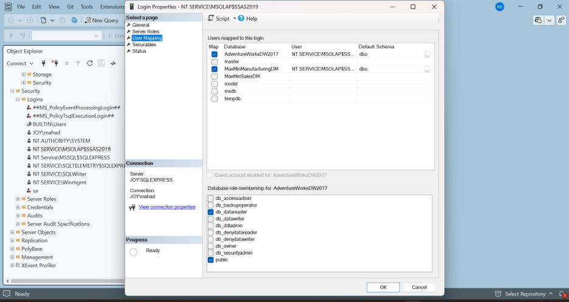

Checked the Manufacturing product data in SQL Server.

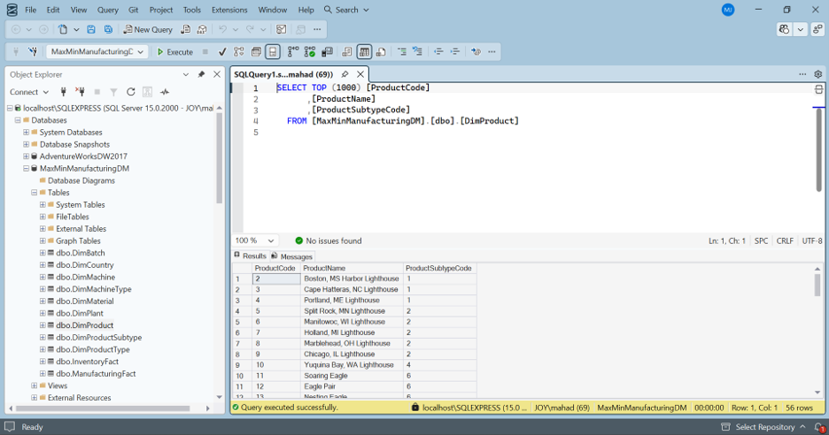

Checked that the supplied Sales database was also available.

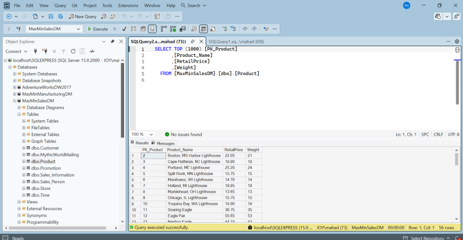

## Date Calculations and Time Dimension

Created Year, Quarter, and Month values from `DateOfManufacture`.

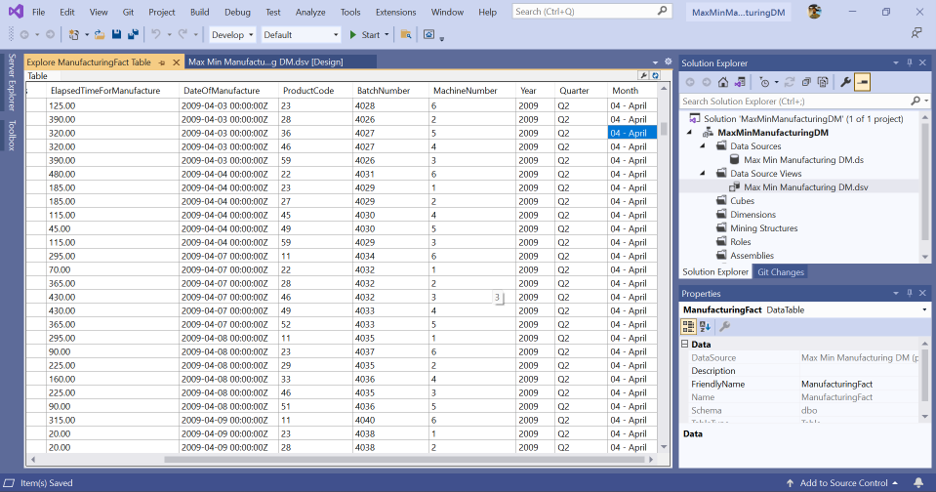

Created the Manufacturing Time dimension with Day, Month, Quarter, and Year attributes.

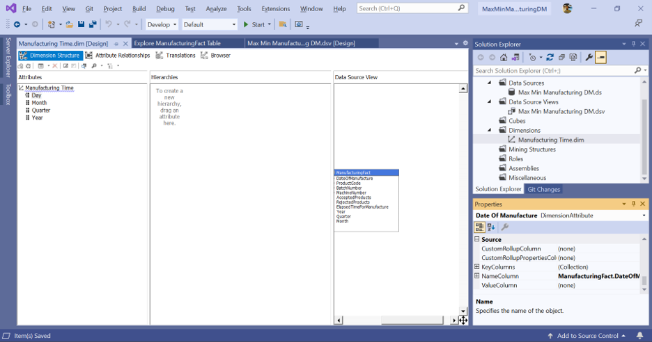

Configured the time attribute relationships.

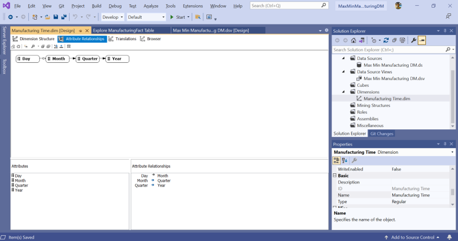

Created the Calendar hierarchy from Year to Day.

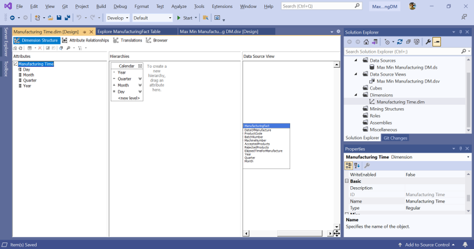

## Data Source View and Cube

Added the fact, dimension, and lookup tables and verified their relationships.

Created the Manufacturing cube with Time, Product, Batch, and Machine dimensions.

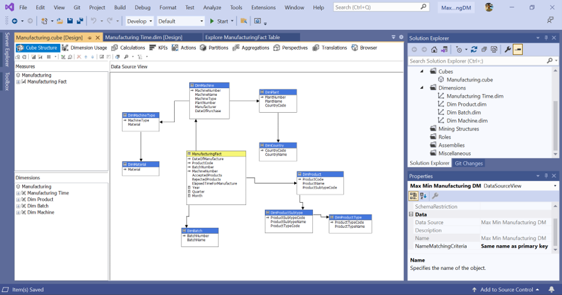

## Product and Machine Dimensions

Configured Product, Product Subtype, and Product Type relationships.

Created the Machine/Material and Plant Geography hierarchies.

Configured the Machine, Machine Type, Material, Plant, and Country relationships.

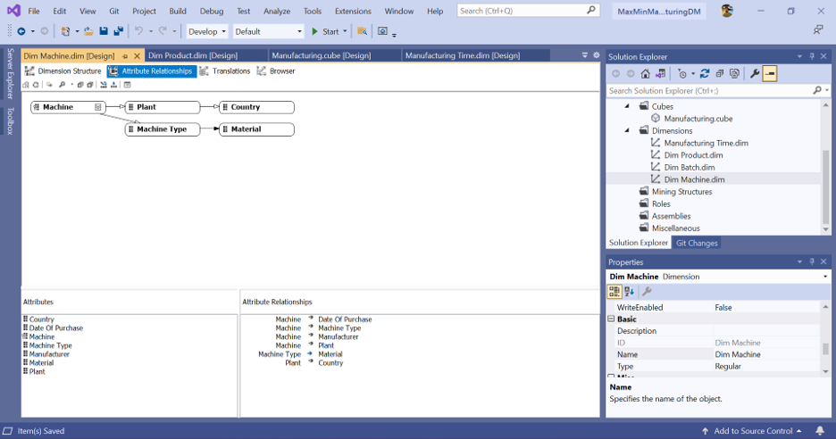

## Measures and Deployment

Connected the Time, Product, Batch, and Machine dimensions to the Manufacturing Fact measure group.

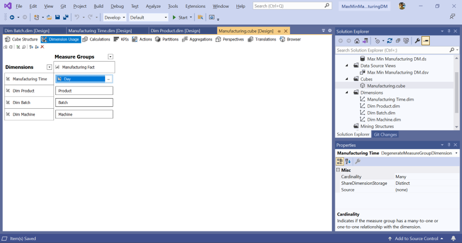

Created the Total Products and Percent Rejected calculated measures.

Built, deployed, and processed the cube successfully.

## Cube Results

Checked the stored and calculated measure totals in the cube browser.

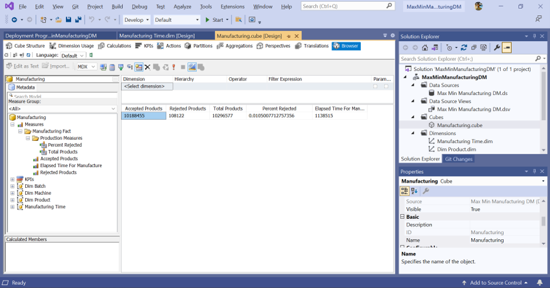

Viewed the measures by Product Type, Product Subtype, and Product.

