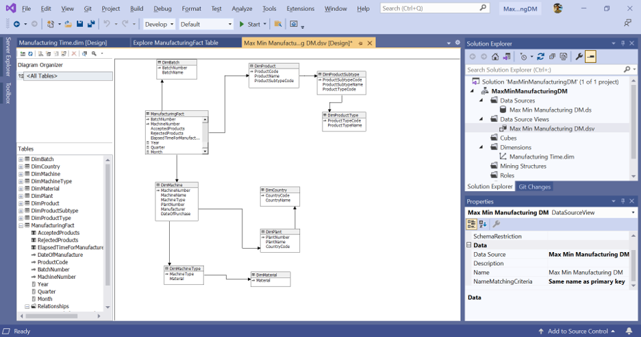
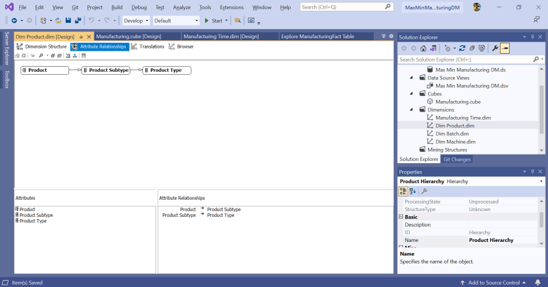
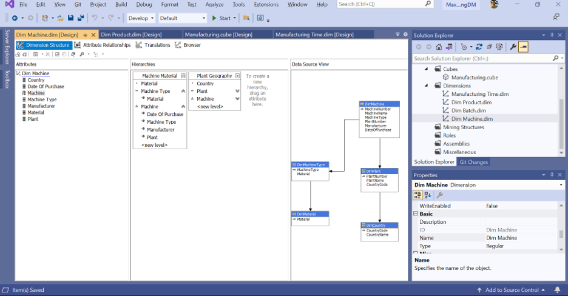
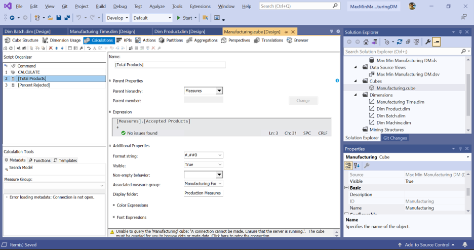
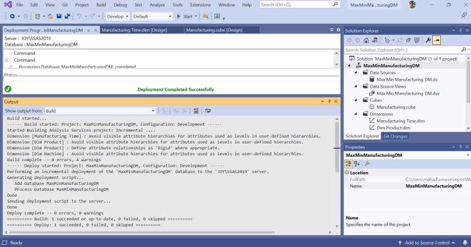
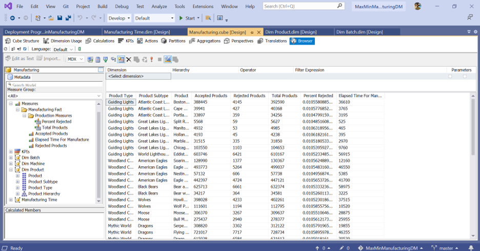

# MaxMin Manufacturing Business Intelligence Project

This repository contains the Manufacturing component of an IT8511 Business Intelligence and Data Mining assignment. It demonstrates the design, deployment, and validation of a SQL Server Analysis Services (SSAS) multidimensional model built from the `MaxMinManufacturingDM` data mart.

The cube is an analytical foundation rather than the final business objective. Its results are used in Excel to assess which requested manufacturing analyses are feasible with the available warehouse data and to support evidence-based recommendations.

## Current Status

- Manufacturing relational database restored and verified
- SSAS service account granted read access
- Data Source and Data Source View created
- Year, Quarter, and Month named calculations added
- Time, Product, Batch, and Machine dimensions configured
- Product, Calendar, Machine/Material, and Plant/Country hierarchies created
- Accepted Products, Rejected Products, and Elapsed Time measures added
- Total Products and Percent Rejected calculated measures added
- Cube built, deployed, processed, and queried successfully
- Excel OLAP reporting in progress
- Sales data-mining models and lift-chart evaluation still to be completed

## Technology

- SQL Server Database Engine
- SQL Server Analysis Services, Multidimensional mode
- Visual Studio 2019 with Analysis Services Projects
- Microsoft Excel OLAP PivotTables and PivotCharts

The local development environment uses:

```text
Database Engine: JOY\SQLEXPRESS
Analysis Services: JOY\SSAS2019
Relational database: MaxMinManufacturingDM
SSAS database: MaxMinManufacturingDM
Cube: Manufacturing
```

These server names are machine-specific and must be changed when the project is opened on another computer.

## Model Overview

`ManufacturingFact` is the cube measure-group table. It is related to Batch, Product, and Machine dimensions, with additional snowflake relationships for Product Type, Product Subtype, Machine Type, Material, Plant, and Country.



The model includes the following user hierarchies:

- Calendar: Year, Quarter, Month, Day
- Product: Product Type, Product Subtype, Product
- Machine/Material: Material, Machine Type, Machine
- Plant Geography: Country, Plant, Machine





## Measures

Stored measures:

- Accepted Products
- Rejected Products
- Elapsed Time For Manufacture

Calculated measures:

```text
Total Products = Accepted Products + Rejected Products
Percent Rejected = Rejected Products / Total Products
```

The Percent Rejected calculation includes division-by-zero protection.



## Deployment and Validation

The project was deployed and processed successfully on the `JOY\SSAS2019` Analysis Services instance.



The cube browser was used to validate totals, calculated measures, and Product hierarchy analysis.



## Data Feasibility Finding

The current warehouse supports analysis of accepted products, rejected products, rejection percentage, and overall manufacturing elapsed time by the available dimensions.

It does not contain separate molding, hardening, painting, or curing durations, and it does not contain a paint-type attribute. Those requirements cannot be answered completely from the current schema. The final recommendations report should propose collecting production-stage timestamps and paint-type data.

## Repository Structure

```text
MaxMinManufacturingDM.sln
MaxMinManufacturingDM/
  MaxMinManufacturingDM.dwproj
  Manufacturing.cube
  Manufacturing Time.dim
  Dim Product.dim
  Dim Batch.dim
  Dim Machine.dim
docs/
  progress.md
  screenshots/
```

## Progress Evidence

The detailed implementation record contains all 17 screenshots and descriptions:

[View the complete progress log](docs/progress.md)

## Remaining Assignment Work

1. Complete the Excel workbook with readable PivotTables, filters, drill-down examples, and column charts.
2. Configure and deploy the supplied `MaxMinSalesDM` project.
3. Create Decision Trees, Naive Bayes, Clustering, and Neural Network mining models.
4. Use the required customer filter and 50/50 training and testing split.
5. Produce and interpret the lift chart.
6. Complete the recommendations report and practice log.

## Security

No passwords or personal credentials should be committed to this repository. Database backup files, user-specific project settings, generated build folders, and saved connection files should remain excluded from source control.
